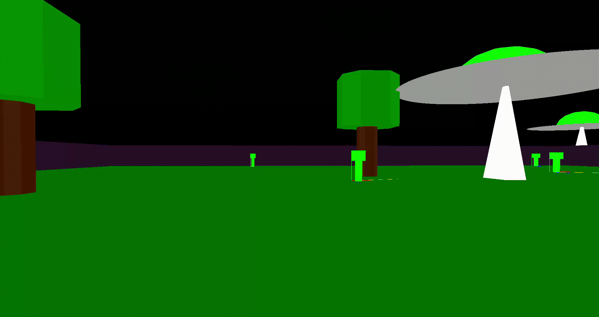

# Image synthesis - Alien3D

## Gameplay
```
The aim is to populate a planet invaded by aliens.

Use the Z,Q,S,D keys to move around, but also click the mouse to move the camera.
By pressing the E key near an alien, you can make it enter a state of search for a partner to reproduce.
```




## Rules for project review:
```
1. Create a world and move around in it.
2. Create two species.
3. Integrate a game into our 3D world.
```

## Installation:
```
Unbuntu:
- sudo apt-get install freeglut3-dev
```

## Launch:
```
make main
./main
```
